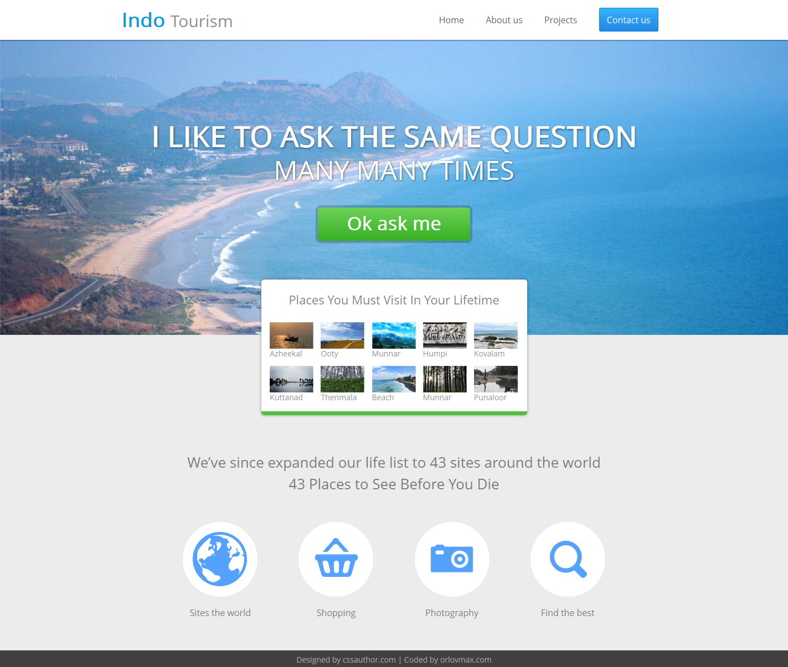
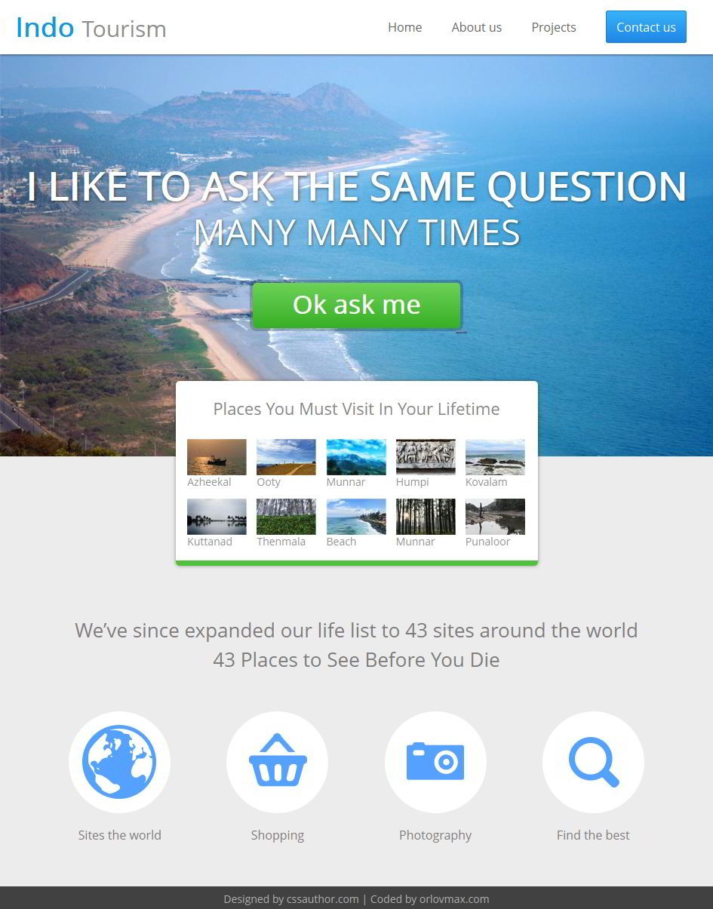
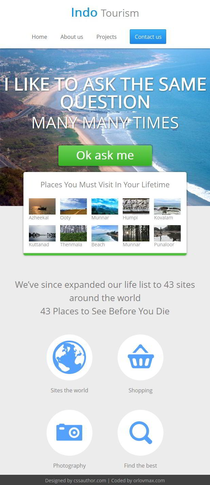
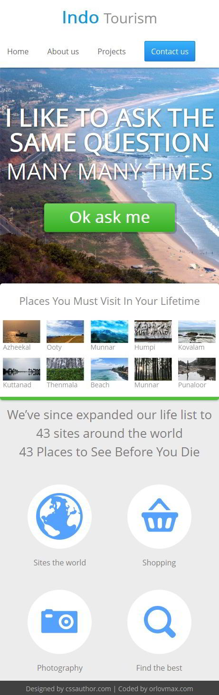

Free travel website template
======
Nice fluid website template, designed by [cssauthor](http://www.cssauthor.com)
###### Powered by html5, css3 and less css
###### Compatible Browsers: IE9+, Firefox, Chrome, Opera, Safari, Yandex.browser
Demo
------
You can see live demo here: [http://orlovmax.com/freebies/travel_website-template](http://orlovmax.com/freebies/travel_website-template "travel website live demo")

Please note
---
In reset.css most of elements `box-sizing` sets to `border-box`. 

Screenshots
---
**Width 1440px (without scrollbar)**

---

**Width 960px (without scrollbar)**

---

**Width 640px (without scrollbar)**

---

**Width 480px (without scrollbar)**

---